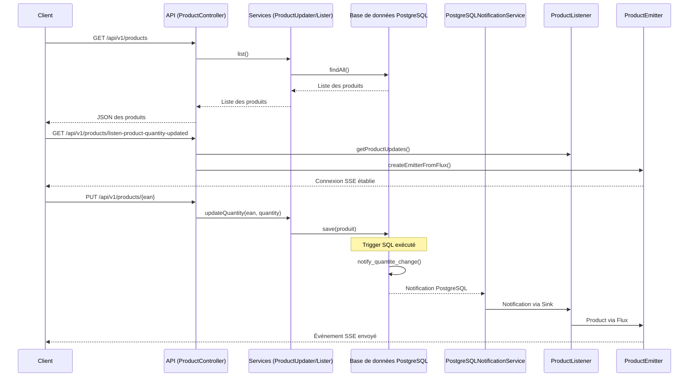
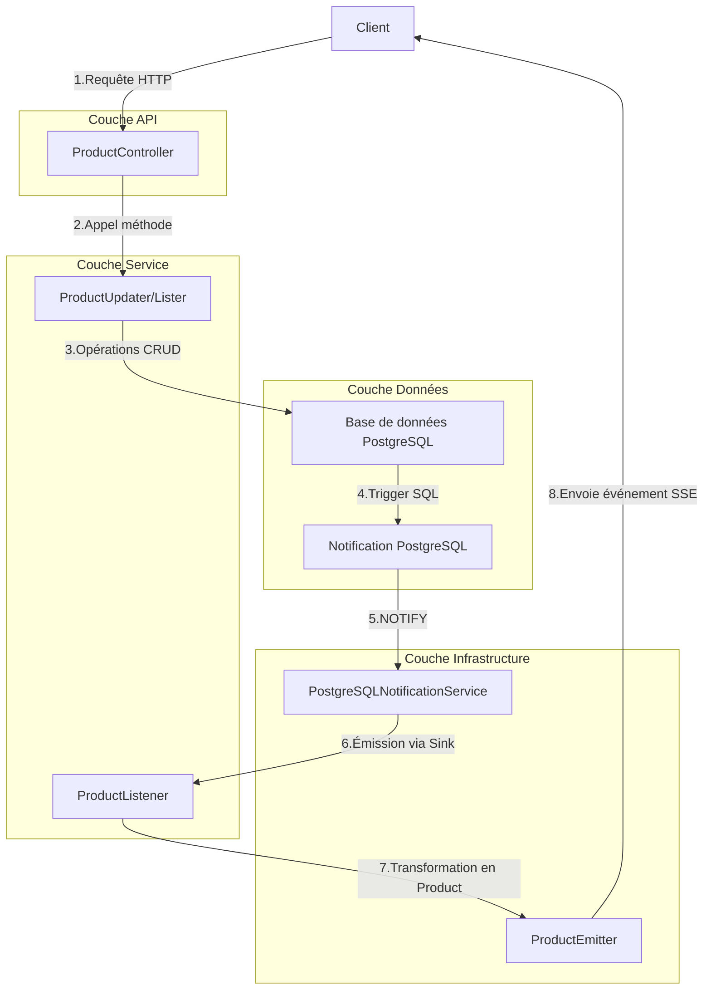

<h1 style="text-align:center">Bienvenue dans le projet Spring SSE 👋</h1>

## Description fonctionnelle
> POC Server Sent Event avec pattern Listen - Notify PostgreSQL<br />
> Cette application démontre l'utilisation des événements envoyés par le serveur (Server-Sent Events) pour notifier les clients des changements de quantité de produits en temps réel.

### Contexte
Ce composant s'inscrit dans le cadre d'une architecture de microservices pour la gestion des produits en temps réel. Il permet de notifier instantanément les clients web lorsque la quantité d'un produit change dans la base de données, sans nécessiter de polling côté client.

La solution utilise le mécanisme natif de notification de PostgreSQL (LISTEN/NOTIFY) couplé à la programmation réactive (Project Reactor) pour diffuser efficacement les événements aux clients connectés via Server-Sent Events (SSE).

### Architecture
Ce composant fait partie de la preuve de concept (POC) d'architecture. Il démontre une approche efficace pour la communication en temps réel entre le backend et les clients web.

[ADR utilisation Reactor](docs/adr-project-reactor-for-postgresql-notifications.md)

### Application
Ce composant sert de référence pour l'implémentation de fonctionnalités de notification en temps réel dans les applications de gestion de produits.
## Technologies utilisées
Cette API est développée avec les technologies suivantes :

- `Java 21 `
- `SpringBoot 3 `
- `Reactor Core :`  Pour la programmation réactive


## 🎬 Démarrage

### 📖 Documentations
- [Configuration Base de Données](docs/configure-db.md)

### 📝 Utilisation de l'API

Vous pouvez utiliser le fichier `request.http` pour tester l'API si vous utilisez un IDE compatible (comme IntelliJ IDEA ou VS Code avec l'extension REST Client).

#### Endpoints disponibles :

1. **Lister tous les produits**
   ```http
   GET http://localhost:8080/api/v1/products
   Accept: application/json
   ```

2. **Mettre à jour la quantité d'un produit**
   ```http
   PUT http://localhost:8080/api/v1/products/1234567890123
   Content-Type: application/json

   {
     "quantity": 2
   }
   ```

3. **Écouter les modifications de quantité en temps réel**
   ```http
   GET http://localhost:8080/api/v1/products/listen-product-quantity-updated
   Accept: text/event-stream
   ```

## 📊 Diagrammes

### Diagramme de séquence



### Diagramme de flux



### Installation des dépendances, compilation et lancement des tests :

```sh
mvn clean install
```

### 🚀 Lancement de l'application :

Démarrer le conteneur PostgreSQL :
```sh
docker compose up -d
```

```sh
mvn spring-boot:run "-Dspring-boot.run.profiles=dev"
```

Pour lancer l'application en local avec un IDE, il faut indiquer à SpringBoot d'utiliser le profil `dev` au démarrage de votre application en ajoutant l'option suivante à la JVM :

```sh
-Dspring.profiles.active=dev
```

- Application : http://localhost:8080/